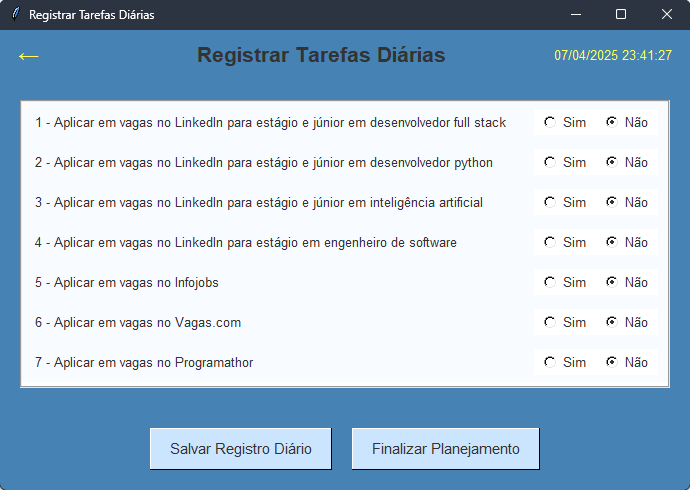

# Sistema de Planejamento Diário

Um sistema simples e eficiente para acompanhar suas tarefas diárias relacionadas à busca de emprego. Este aplicativo permite registrar, acompanhar e analisar o seu progresso diário em diferentes atividades de procura de trabalho.

<div style="display: flex; justify-content: space-between;">
   
   
</div>

## Principais Funcionalidades

- **Registro de Tarefas Diárias**: Marque quais tarefas você realizou no dia.
- **Relatório Semanal**: Gere relatórios para acompanhar seu progresso ao longo da semana.
- **Interface Intuitiva**: Design amigável com cores suaves e tooltips informativos.
- **Salvamento Automático**: Seus registros são automaticamente salvos em arquivos de texto para consultas futuras.
- **Indicador de Status**: Mostra claramente se o planejamento do dia está pendente, iniciado ou concluído.
- **Atualização Automática**: Detecta automaticamente a mudança de dia e atualiza o status do planejamento.

## Instalação para Usuários sem Experiência em Programação

### Pré-requisitos

Antes de começar, você precisará:

1. **Python**: O programa é desenvolvido em Python. Se você não tem Python instalado:
   - Visite [python.org](https://www.python.org/downloads/)
   - Baixe e instale a última versão disponível (3.8 ou superior)
   - **IMPORTANTE**: Durante a instalação, marque a opção "Add Python to PATH"

### Baixando o Programa

Existem duas maneiras de obter o programa:

#### Opção 1: Baixar como ZIP (Mais fácil)

1. Visite [https://github.com/RodCinelli/Planilha-Vagas](https://github.com/RodCinelli/Planilha-Vagas)
2. Clique no botão verde "Code" 
3. Selecione "Download ZIP"
4. Extraia o arquivo ZIP para uma pasta de sua preferência

#### Opção 2: Clonar o Repositório (Para quem está familiarizado com Git)

```
git clone https://github.com/RodCinelli/Planilha-Vagas.git
```

### Instalando as Dependências

Após baixar o programa, você precisa instalar as bibliotecas necessárias:

1. Abra o Prompt de Comando (Windows) ou Terminal (Mac/Linux)
2. Navegue até a pasta onde o programa foi extraído/clonado:

   ```
   cd caminho/para/Planilha-Vagas
   ```
3. Instale as dependências:

   ```
   pip install tkinter
   ```

### Executando o Programa

Após a instalação:

1. Ainda no Prompt de Comando/Terminal:

   ```
   python planejamento_diario.py
   ```
2. O programa será iniciado e você verá a tela principal

## Como Usar o Sistema

### Tela Principal

A tela principal apresenta quatro opções principais e um indicador de status na parte inferior:

- **Registrar ou Atualizar Tarefas**: Abre uma nova janela para marcar as tarefas realizadas no dia.
- **Resetar Planejamento do Dia**: Apaga os registros do dia atual para começar novamente.
- **Gerar Relatório Semanal**: Cria um arquivo de texto com um resumo das atividades da semana.
- **Fechar o Programa**: Encerra a aplicação.

O **Indicador de Status** na parte inferior da janela mostra um dos seguintes estados:
- **Sem planejamento hoje**: Você ainda não iniciou o planejamento para o dia atual.
- **Planejamento iniciado**: Você já começou a registrar tarefas, mas ainda não finalizou o planejamento.
- **Planejamento diário concluído**: Você completou o planejamento para o dia atual.

### Registrando Tarefas

1. Clique em "Registrar ou Atualizar Tarefas"
2. Para cada atividade listada, selecione "Sim" se você a realizou ou "Não" caso contrário
3. Clique em "Salvar Registro Diário" para guardar seu progresso parcial

   - O status será atualizado para "Planejamento iniciado"

4. Quando terminar, clique em "Finalizar Planejamento" para completar o registro do dia

   - O status será atualizado para "Planejamento diário concluído"

### Relatórios

1. Clique em "Gerar Relatório Semanal" para criar um resumo da sua semana
2. O sistema informará onde o arquivo foi salvo (geralmente em `planejamento/semanal/`)
3. Abra o arquivo com qualquer editor de texto para visualizar o relatório

## Personalizando o Programa

### Alterando as Tarefas

Se você deseja alterar as tarefas pré-definidas:

1. Abra o arquivo `planejamento_diario.py` em qualquer editor de texto (Notepad, VSCode, etc.)
2. Localize o bloco de código que começa com `# Cabeçalho das tarefas` (aproximadamente linha 26)
3. Modifique as descrições das tarefas conforme sua necessidade:

```python
# Cabeçalho das tarefas
tarefas = {
   "1": "Sua primeira tarefa personalizada aqui",
   "2": "Sua segunda tarefa personalizada aqui",
   # Adicione mais tarefas se necessário
   "8": "Uma tarefa adicional",  # Você pode adicionar novas tarefas
}
```

4. Salve o arquivo e execute novamente o programa

### Ajustando o Tamanho da Janela

Se você adicionou mais tarefas e precisa de uma janela maior:

1. Abra o arquivo `planejamento_diario.py` em um editor de texto
2. Para ajustar o tamanho da janela principal, localize as linhas (aproximadamente linha 414):

```python
# Definir tamanho e centralizar a janela principal
largura_root = 450  # Modifique este valor para aumentar a largura
altura_root = 500   # Modifique este valor para aumentar a altura
```

3. Para ajustar o tamanho da janela de tarefas, localize as linhas (aproximadamente linha 175):

```python
# Definir tamanho e centralizar a janela de tarefas
largura_tarefas = 690  # Modifique este valor para aumentar a largura
altura_tarefas = 460   # Modifique este valor para aumentar a altura
```

4. Salve o arquivo e execute novamente o programa

### Ajustando Cores

Se você quiser personalizar as cores:

1. Abra o arquivo `planejamento_diario.py` em um editor de texto
2. Localize o bloco de código que começa com `# Definição da paleta de cores` (aproximadamente linha 6)
3. Modifique os códigos de cores conforme desejado:

```python
# Definição da paleta de cores
COR_PRINCIPAL = "#4682B4"  # Azul escuro para fundo
COR_DESTAQUE = "#4DA6FF"   # Azul médio para elementos de destaque
# ... outras cores
```

4. Salve o arquivo e execute novamente o programa

## Criando um Executável do Programa

Se você deseja criar um arquivo executável (.exe) para não precisar do Python instalado:

1. Primeiro, instale a ferramenta auto-py-to-exe:
   ```
   pip install auto-py-to-exe
   ```

2. Execute a ferramenta:
   ```
   auto-py-to-exe
   ```

3. Na interface gráfica que se abrirá:
   - Em "Script Location", selecione o arquivo `planejamento_diario.py`
   - Em "Onefile", selecione "One File" para criar um único executável
   - Em "Console Window", selecione "Window Based" para ocultar a janela de console
   - Em "Additional Files", adicione a pasta "planejamento" se desejar incluí-la no executável
   - Clique em "Convert .py to .exe"

4. Após a conversão, um arquivo executável será criado no diretório de saída especificado

5. Agora você pode compartilhar este arquivo .exe com qualquer pessoa, e elas poderão executá-lo sem ter o Python instalado

## Recursos Avançados

### Atualização Automática do Status

O sistema verifica automaticamente a mudança de dia e atualiza o status do planejamento:

- A cada minuto, o programa verifica se o dia mudou
- Quando um novo dia começa, o status é automaticamente atualizado para "Sem planejamento hoje"
- Não é necessário reiniciar o programa para que o status seja atualizado

### Arquivos Salvos

O sistema organiza seus dados em uma estrutura clara:

- **Planejamentos diários**: Salvos em `planejamento/diario/` com o formato `planejamento_YYYY-MM-DD_DiaDaSemana.txt`
- **Relatórios semanais**: Salvos em `planejamento/semanal/` com o formato `relatorio_semanal_YYYY-MM-DD_YYYY-MM-DD.txt`

Os arquivos diários contêm uma marcação especial "CONCLUÍDO" quando você finaliza o planejamento do dia, o que permite ao sistema exibir o status correto mesmo após reiniciar o programa.

## Solução de Problemas

### O programa não abre

- Verifique se o Python está instalado corretamente
- Confirme se todas as dependências foram instaladas
- Tente executar o programa pelo prompt de comando para ver mensagens de erro

### Erro "ModuleNotFoundError"

- Este erro indica que alguma biblioteca está faltando
- Execute `pip install [nome_da_biblioteca]` para instalar a biblioteca necessária

### Problemas com permissões de arquivo

- Verifique se você tem permissões de escrita na pasta onde o programa está instalado
- Tente executar o programa como administrador

## Suporte e Contribuições

Para obter suporte, relatar bugs ou sugerir melhorias, abra uma issue no repositório GitHub:
[https://github.com/RodCinelli/Planilha-Vagas/issues](https://github.com/RodCinelli/Planilha-Vagas/issues)

---

Desenvolvido para auxiliar na organização da busca por vagas de emprego.